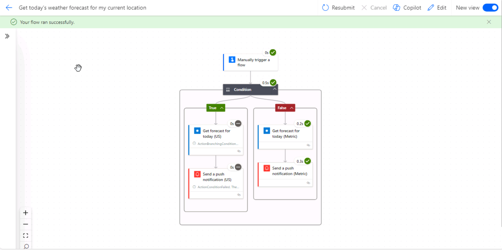
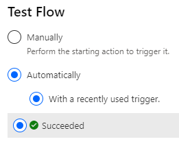
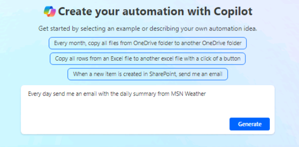

---
lab:
  title: 实验室 1：创建云端流
  module: 'Module 1: Get started with Power Automate'
---

# 练习实验室 1 - 创建云端流

在此实验室中，你将创建云端流。

## 要学习的知识

- 如何通过模板和 CoPilot 创建 Power Automate 云端流
- 如何从空白创建 Power Automate 云端流并添加操作

## 概要实验室步骤

- 从模板创建云端流
- 使用 CoPilot 创建云端流
- 创建云端流
- 监视云端流活动
  
## 先决条件

- 必须已完成**实验室 0：验证实验室环境**

## 详细步骤

## 练习 1 - 通过模板创建云端流

### 任务 1.1 - 选择模板

1. 导航到 Power Automate 门户 `https://make.powerautomate.com`。

1. 如果显示了“**欢迎使用 Power Automate**”弹出对话框，请选择“**开始**”。

1. 选择“Dev One”环境。****

    

1. 从左侧菜单中选择“模版”选项卡。****

1. 选择“按钮”选项卡。****

1. 在“**搜索模板**”字段中，输入“`location`”。

    

1. 选择“获取我当前位置的今日天气预报”。****

    

1. 为“MSN 天气”选择“创建”。********

1. 为“通知”选择“创建”。********

1. 选择**创建流**。

1. 如果显示了“**流已准备就绪**”弹出对话框，请选择“**不再显示此信息**”，然后选择“**知道了**”。

    

### 任务 1.2 - 运行流

1. 选择**运行**。

1. 如果出现提示，请为“知道你的位置”选择“允许” ********

1. 选择**继续**。

1. 选择**运行流**。

1. 选择**完成**。

    

### 任务 1.3 - 查看流

1. 选择流运行历史记录中的日期和时间。

    

1. 选择“条件”步骤以展开流步骤。****

    

1. 选择带有绿色勾号的“获取今日预报”步骤。****

    

1. 选择“编辑”  。

1. 选择“条件”步骤以展开流步骤。****

1. 选择**展开条件**。

1. 选择某个“发送推送通知”步骤。****

1. 选择“流检查器”。**** 应该不会有错误或警告。

1. 关闭“流检查器”窗格。****

### 任务 1.4 - 测试流

1. 选择“测试”，选择“自动”，选择“使用最近使用的触发器”，然后选择流运行。************

    

1. 选择“测试”。

1. 从命令栏左上角选择 <- 后退按钮。****

## 练习 2 - 使用 CoPilot 创建云端流

### 任务 2.1 - 输入提示

1. 导航到 Power Automate 门户 `https://make.powerautomate.com`。 

1. 确保你位于“Dev One”环境中。****

1. 从左侧菜单中选择“主页”选项卡。****

1. 在“**让我们自动化一些操作。它应该做什么?**”下，输入“`Every day send me an email with the daily summary from MSN Weather`”。

    

1. 选择**生成**。

    

1. 选择**下一步**。

1. 选择**创建流**。

    

### 任务 2.2 - 配置流步骤

1. 选择“获取今日预报”步骤****。

1. 为“位置”输入“`Seattle`”。****

1. 选择“**X**”以清除“**单位**”，然后在下拉列表中选择“**英制**”。

    

1. 选择“保存”。

1. 要测试流，请选择“**测试**”，选择“**手动**”，然后选择“**运行流**”。 选择“完成”  。

1. 从命令栏左上角选择 <- 后退按钮。****

## 练习 3 - 从空白创建云端流

### 任务 3.1 - 创建触发器

1. 导航到 Power Automate 门户 `https://make.powerautomate.com`。

1. 确保你位于 **Dev One** 环境中。

1. 从左侧菜单中选择“**+ 创建**”选项卡。

1. 选择“**自动化云端流**”。

1. 输入 `Important email` 作为流名称。

1. 在“**搜索所有触发器**”字段中，输入“`email arrives`”。

1. 选择“新电子邮件到达时(V3)”。****

    

1. 选择**创建**。

### 任务 3.2 - 配置触发器

1. 选择“新电子邮件到达时(V3)”步骤****。

1. 选择“全部显示”。****

    

1. 为“包含附件”选择“否”。********

1. 为“重要性”选择“高”。********

1. 为“文件夹”选择“收件箱”。********

### 任务 3.3 - 添加操作

1. 选择触发器步骤下的 + 图标，然后选择“添加操作”。********

1. 在搜索中输入“`notification`”。

    

1. 在 Microsoft Teams 下选择“发布源通知”。********

1. 选择“**登录**”。

1. 使用你的租户凭据。

1. 为“通知类型”选择“团队”。********

1. 为“接收方”输入你的租户用户 ID。****

1. 在“**通知文本**”字段中输入“`/`”，然后选择“**插入动态内容**”。

    

1. 选择“主题”。****

1. 为“团队”选择“Contoso”。********

1. 为“频道”选择“常规”。********

1. 选择“保存”。

1. 从命令栏左上角选择 <- 后退按钮。****

## 练习 4 - 监视流

### 任务 4.1 - 云端流活动

1. 导航到 Power Automate 门户 `https://make.powerautomate.com`。

1. 确保你位于“Dev One”环境中。****

1. 选择 **...更多**（在左侧菜单中）。

    

1. 选择“云端流活动”的固定图标。****

1. 从左侧菜单中选择“云端流活动”选项卡。****

    

