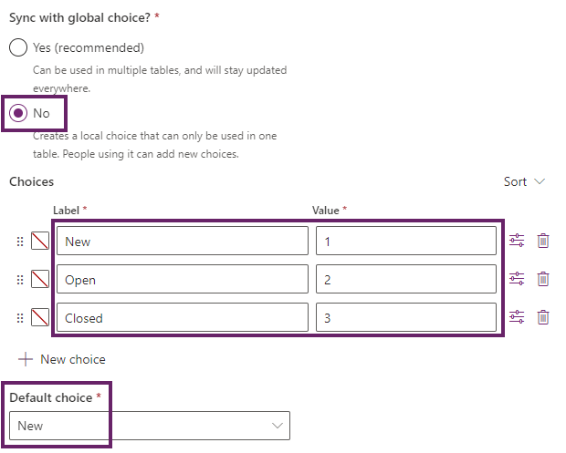

---
lab:
  title: 实验室 2：数据模型
  module: 'Module 2: Get started with Microsoft Dataverse'
---

# 练习实验室 2 – 数据模型

在此实验室中，你将创建 Dataverse 表和列。

## 要学习的知识

- 如何在 Microsoft Dataverse 中创建表和列
- 如何创建与查找列的关系

## 概要实验室步骤

- 创建自定义表
- 向表添加列
- 通过使用查找列创建与查找列的关系
  
## 先决条件

- 必须已完成**实验室 0：验证实验室环境**

## 详细步骤

## 练习 1 - 创建自定义表

### 任务 1.1 - 创建商机表

1. 导航到 Power Apps Maker 门户 <https://make.powerapps.com>。

1. 确保你位于 **Dev One** 环境中。

1. 在左侧导航窗格中，选择**表**。

1. 选择“**+ 新建表**”，然后选择“**添加列和数据**”。

    

1. 选择“新建表”旁编的“**铅笔**”图标

    

1. 在“显示名称”中输入 `Opportunity`。

1. 选择“保存”。

### 任务 1.2 - 主列

1. 选择“**新建列**”旁边的下拉列表插入符号，然后选择“**编辑列**”。

    

1. 在“显示名称”中输入 `Opportunity Subject`。

1. 选择**更新**。

1. 选择**创建**。

### 任务 1.3 - 添加列

1. 在“**商机列和数据**”窗格中，选择“**+**”以添加新列。

    

1. 在“**新建列**”窗格中，输入或选择以下值：

   1. 显示名称：`Owner Name`
   1. 数据类型：**单行文本**
   1. Required:**需要业务**

    

1. 选择“保存”。

1. 在“**商机列和数据**”窗格中，选择“**+**”以添加新列。

1. 在“**新建列**”窗格中，输入或选择以下值：

   1. 显示名称：`Customer`
   1. 数据类型：**单行文本**
   1. Required:**需要业务**

1. 选择“保存”。

1. 在“**新建列**”窗格中，输入或选择以下值：

   1. 显示名称：`Address`
   1. 数据类型：**单行文本**
   1. Required:**可选**

1. 展开“**高级**”选项并输入 `200` 作为“**最大字符计数**”。

1. 选择“保存”。

1. 在“**商机列和数据**”窗格中，选择“**+**”，然后在“**新建列**”窗格中输入或选择以下值：

   1. 显示名称：`Estimated Close Date`
   1. 数据类型：**日期和时间**
   1. 格式：**仅日期**
   1. Required:**可选**

1. 选择“保存”。

1. 在“**商机列和数据**”窗格中，选择“**+**”，然后在“**新建列**”窗格中输入或选择以下值：

   1. 显示名称：`Amount`
   1. 数据类型：货币****
   1. Required:**可选**

1. 选择“保存”。

1. 在“**商机列和数据**”窗格中，选择“**+**”，然后在“**新建列**”窗格中输入或选择以下值：

   1. 显示名称：`Notes`
   1. 数据类型：**多行文本**
   1. 格式：**Text**
   1. Required:**可选**

1. 选择“保存”。

### 任务 1.4 - 添加选择列

1. 在“**商机列和数据**”窗格中，选择“**+**”，然后在“**新建列**”窗格中输入或选择以下值：

   1. 显示名称：`Status`
   1. 数据类型：**选项**
   1. Required:**可选**

1. 对于“**与全局选项同步？**”，选择“**否**”

1. 对于“**标签**”，输入“`New`”，对于“**值**”，则输入“`1`”。

1. 选择“**+ 新建选项**”，然后为“**标签**”输入“`Open`”，为“**值**”输入“`2`”。

1. 选择“**+ 新建选项**”，然后为“**标签**”输入“`Closed`”，为“**值**”输入“`3`”。

1. 为“**默认值**”选择“**新建**”。

    

1. 选择“保存”。

## 练习 2 - 创建关系

### 任务 2.1 - 创建查找列

1. 导航到 Power Apps Maker 门户 <https://make.powerapps.com>。

1. 确保你位于 **Dev One** 环境中。

1. 在左侧导航窗格中，选择**表**。

1. 选择**商机**。

1. 在“**商机列和数据**”窗格中，选择“**+**”，然后在“**新建列**”窗格中输入或选择以下值：

   1. 显示名称：`Account`
   1. 数据类型：**查找**
   1. Required:**可选**
   1. 相关表：**帐户**

    

1. 选择“保存”。

## 练习 3 - 数据

### 任务 3.1 - 添加商机记录

1. 导航到 Power Apps Maker 门户 <https://make.powerapps.com>。

1. 确保你位于 **Dev One** 环境中。

1. 在左侧导航窗格中，选择**表**。

1. 选择**商机**。

1. 在“**商机列和数据**”窗格中，选择“**编辑**”旁边的下拉插入符号，然后选择“**在新建选项卡中编辑**”。

1. 输入或选择以下值：

   1. 商机主题：`100 Widgets`
   1. 所有者名称：`MOD Administrator`
   1. 客户：`Adventure Works`
   1. 估计的结束日期：**选择上一个月的日期**
   1. 状态：**已结束**
   1. 金额：`10,000`

1. 选择“**在下方插入列**”，然后输入或选择以下值：

   1. 商机主题：`Key customer`
   1. 所有者名称：`MOD Administrator`
   1. 客户：`Fabrikam`
   1. 估计的结束日期：**选择本月未来的日期**
   1. 状态：**新建**
   1. 金额：`50,000`

1. 选择“**在下方插入列**”，然后输入或选择以下值：

   1. 商机主题：`New customer`
   1. 所有者名称：`MOD Administrator`
   1. 客户：`Coho Winery`
   1. 估计的结束日期：**选择下个月的日期**
   1. 状态：**新建**
   1. 金额：`25,000`

1. 选择“**在下方插入列**”，然后输入或选择以下值：

   1. 商机主题：`Repeat customer`
   1. 所有者名称：`MOD Administrator`
   1. 客户：`Fourth Coffee`
   1. 估计的结束日期：**选择下个月的日期**
   1. 状态：**打开**
   1. 金额：`15,000`

    

1. 关闭“编辑数据”选项卡。
