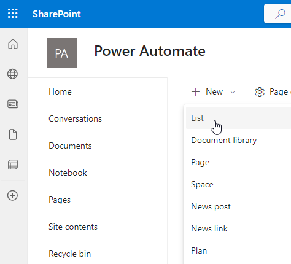

---
lab:
  title: 实验室 3：SharePoint
  module: 'Module 3: Build approval flows with Power Automate'
---

# 练习实验室 3 – SharePoint

在此实验室中，你将创建 SharePoint 网站和列表。

## 要学习的知识

- 如何创建 SharePoint 列表
- 如何上传数据

## 概要实验室步骤

- 创建 SharePoint 列表获取机会
  
## 先决条件

- 必须已完成**实验室 0：验证实验室环境**

## 详细步骤

## 练习 1 - 创建 SharePoint 列表

### 任务 1.1 创建 SharePoint 网站

1. 在 Power Apps 创建者门户中，`https://make.powerapps.com`

1. 选择浏览器窗口左上角的“**应用启动器**”，然后选择“**SharePoint**”。

    

1. 如果显示“**欢迎使用 SharePoint 起始页**”弹出对话框，请选择“**X**”以关闭对话框。

1. 在 SharePoint 中，选择“**+ 创建网站**”。

1. 依次选择“**团队网站**”、“**标准团队** ”、“**使用模板**”。

1. 输入`Power Automate`作为**网站名称**，然后选择“**下一步**”。

1. 选择**创建站点**。

1. 选择“完成”。

1. 如果显示了“开始设计网站”弹出对话框，请关闭此对话框。****

### 任务 1.2 创建 SharePoint 列表

1. 在 SharePoint 网站中，依次选择“**+ 新建**”、“**列表**”。

    

1. 在“**从空白创建**”下选择“**列表**”。

1. 输入`Tasks`作为**名称**，然后选择“**创建**”。

1. 依次选择“**+ 添加列**、“**多行文本**”、“**下一步**”。

1. 在“**创建列**”窗格中，输入或选择以下值：

   1. 名称：`Description`
   1. 类型：**多行文本**

1. 选择“保存”。

1. 依次选择“**+添加列**、“**文本**”、“**下一步**”。

1. 在“**创建列**”窗格中，输入或选择以下值：

   1. 名称：`Owner Name`
   1. 类型：**单行文本**

1. 选择“保存”。

1. 依次选择“**+添加列**、“**日期和时间**”、“**下一步**”。

1. 在“**创建列**”窗格中，输入或选择以下值：

   1. 名称：`Deadline`
   1. 类型：**日期和时间**

1. 选择“保存”。

1. 依次选择“**+添加列**、“**选项**”、“**下一步**”。

1. 在“**创建列**”窗格中，输入或选择以下值：

   1. 名称：`Approval Status`
   1. 类型：**选项**
   1. 选项 1=`New`
   1. 选项 2=`Approved`
   1. 选项 3=`Declined`

1. 为**默认值**选择“**新建**”

    

1. 选择“保存”。

1. 复制 SharePoint 网站的 URL 的第一部分，例如`https://m365x99999999.sharepoint.com/sites/PowerAutomate/`

## 练习 2 - 添加数据 SharePoint 列表

### 任务 2.1 - 添加数据

1. 导航到 SharePoint 网站并选择“**任务**”列表。

    

1. 选择“**+ 添加新项**”并输入以下数据，然后选择“**保存**”：

   1. Title=`Contact Jon`
   1. 说明=`Call or email`
   1. 所有者名称=`MOD Administrator`
   1. 截止时间=**昨天**
   1. 审批状态=**已拒绝**

1. 选择“**+ 添加新项**”并输入以下数据，然后选择“**保存**”：

   1. Title=`Create Quote`
   1. 说明=`No discount`
   1. 所有者名称=`MOD Administrator`
   1. 截止时间=**今天**
   1. 审批状态=**已批准**

1. 选择“**+ 添加新项**”并输入以下数据，然后选择“**保存**”：

   1. Title=`Visit Jim`
   1. 说明=`First visit`
   1. 所有者名称=`MOD Administrator`
   1. 截止时间=**明天**
   1. 审批状态=**新**

    
