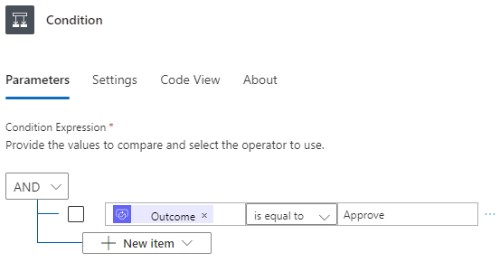

---
lab:
  title: 实验室 4：审批流
  module: 'Module 3: Build approval flows with Power Automate'
---

# 练习实验室 4 - 审批流

在此实验室中，你将创建审批流。

## 要学习的知识

- 如何创建 Power Automate 审批云端流

## 概要实验室步骤

- 为 SharePoint 列表创建自动化云端流
- 创建审批
- 添加审批结果的条件
- 测试流
  
## 先决条件

- 必须已完成**实验室 3：SharePoint**

## 详细步骤

## 练习 1 - 创建审批流

### 任务 1.1 - 创建触发器

1. 导航到 Power Automate 门户 `https://make.powerautomate.com`。

1. 确保你位于 **Dev One** 环境中。

1. 从左侧导航面板中选择“**+ 创建**”选项卡。

1. 选择“**自动化云端流**”。

1. 输入 `Task approval` 作为流名称。

1. 在搜索中输入“`SharePoint`”。

1. 选择“当创建项时”。****

1. 选择**创建**。

### 任务 1.2 - 配置触发器

1. 选择“当创建项时”步骤。****

1. 选择“**创建项目时**”的步骤名称并输入 `New task`。

1. 选择在以前的实验室中创建的 **Power Automate SharePoint 网站**。 如果未列出网站，请选择“**输入自定义值**”并粘贴 Power Autmate SharePoint 网站的 URL

1. 选择“任务”列表。****

    

### 任务 1.3 - 添加审批操作

1. 选择触发器步骤下的 + 图标，然后选择“添加操作”。********

1. 在搜索中输入“`approval`”。

    

1. 在“审批”下选择“开始并等待审批”。********

1. 选择“新建”。

1. 为“审批类型”选择“批准/拒绝 - 首先回应”********

1. 选择“**开始并等待审批**”步骤名称，然后输入“`Approval`”。

1. 在“**标题**”字段中输入“`/`”，然后选择“**插入动态内容**”。

1. 选择“**新任务**”下的“**标题**”。

    

1. 为“分配到”输入你的租户用户 ID。****

1. 在“**详细信息**”字段中输入“`/`”，然后选择“**插入动态内容**”。

1. 选择“说明”。****

1. 在“**项目链接**”字段中输入“`/`”，然后选择“**插入动态内容**”。 

1. 选择“**查看详细信息**”，选择“**链接到项**”。

### 任务 1.4 - 添加条件

1. 选择审批步骤下的 + 图标，然后选择“添加操作”。********

1. 在搜索中输入“`condition`”。

1. 在“控制”下选择“条件”。********

1. 在“**选择值**”字段中输入“`/`”，然后选择“**插入动态内容**”对话框。

    

1. 选择“结果”****。

1. 为“运算符”选择“等于”。********

1. 选择右侧的“**选择值**”字段，然后输入“`Approve`”。

    

### 任务 1.5 - 更新状态操作

1. 选择“True”下的 + 图标，然后选择“添加操作”。************

1. 在搜索中输入“`update item`”。

1. 在 SharePoint 下选择“更新项”。********

1. 选择“**更新项目**”步骤名称并输入“`Set task to approved`”。

1. 选择“Power Automate SharePoint 网站”。****

1. 选择“任务”列表。****

1. 在“**ID**”字段中输入“`/`”，然后选择“**插入动态内容**”。

1. 从“**新任务**”中选择“**ID**”。

1. 选择**高级参数**下的**全部显示**。

1. 在“**标题**”字段中输入“`/`”，然后选择“**插入动态内容**”。

1. 从“新任务”中选择“标题”。********

1. 为“审批状态值”选择“已批准”。********

1. 选择“False”下的 + 图标，然后选择“添加操作”。************

1. 在搜索中输入“`update item`”。

1. 在 SharePoint 下选择“更新项”。********

1. 选择“**更新项目 1**”步骤名称并输入 `Set task to declined`。

1. 选择“Power Automate SharePoint 网站”。****

1. 选择“任务”列表。****

1. 在“**ID**”字段中输入“`/`”，然后选择“**插入动态内容**”。

1. 从“**新任务**”中选择“**ID**”。

1. 选择“全部显示”。****

1. 在“**标题**”字段中输入“`/`”，然后选择“**插入动态内容**”。

1. 从“新任务”中选择“标题”。********

1. 选择“**已拒绝**”作为“**审批状态值**”。

1. 选择“保存”。

1. 从命令栏左上角选择 <- 后退按钮。****

## 练习 2 - 测试审批

### 任务 2.1 - 触发审批流

1. 导航到 SharePoint 网站并选择“任务”列表。****

1. 选择“+ 新建”并输入以下数据，然后选择“保存”：********

   1. 标题=`Approval test`
   1. 说明=`Test`
   1. 所有者名称=`MOD Administrator`
   1. 截止时间=**今天**
   1. 审批状态=**新**

### 任务 2.2 - 进度审批

1. 导航到 Power Automate 门户 `https://make.powerautomate.com`。

1. 确保你位于 **Dev One** 环境中。

1. 从左侧导航菜单中选择“**我的流**”选项卡。

1. 选择“任务审批”。****

1. 选择流运行历史记录中的日期和时间。

    > **备注：** 审批功能将在后台安装。 这大约需要 10 分钟。

1. 从左侧导航菜单中选择“**审批**”选项卡。

    

1. 选择“审批测试”，选择“勾选”，然后选择“确认”。************

1. 选择“完成”  。

1. 从左侧导航菜单中选择“**我的流**”选项卡。

1. 选择“任务审批”。****

1. 选择“**28 天运行历史记录**”中的日期和时间。

1. 导航到 SharePoint 网站并选择“任务”列表。****

1. 验证“审批测试”项的“审批状态”是否为“已批准”。************

