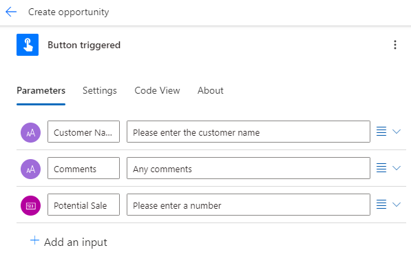
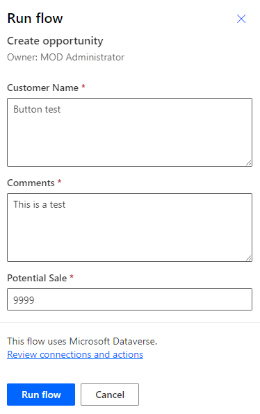

---
lab:
  title: 实验室 5：按钮流
  module: 'Module 4: Build flows to manage user information'
---

# 实践实验室 5 – 按钮流

在此实验室中，你将创建一个按钮流。

## 要学习的知识

- 如何创建 Power Automate 即时按钮流

## 概要实验室步骤

- 创建按钮流
- 使用触发器令牌
- 添加用户输入
- 测试流
  
## 先决条件

- 必须已完成“**实验室 2：数据模型**

## 详细步骤

## 练习 1 - 创建按钮流

### 任务 1.1 - 创建触发器

1. 导航到 Power Automate 门户 `https://make.powerautomate.com`。

1. 确保你位于 **Dev One** 环境中。

1. 从左侧菜单中选择“+ 创建”选项卡。****

1. 选择**即时云端流。**

1. 输入 `Create opportunity` 作为流名称。

1. 选择“手动触发流”****。

1. 选择**创建**。

### 任务 1.2 - 添加用户输入

1. 选择“手动触发流”步骤。****

1. 选择“**手动触发流**”步骤名称，并输入“`Button triggered`”。

1. 选择**添加输入**。

1. 选择“文本”。

1. 在“输入”中输入 `Customer Name`。****

1. 在“请输入你的输入”中输入 `Please enter the customer name`。****

1. 选择**添加输入**。

1. 选择“文本”****

1. 在“输入”中输入 `Comments`。****

1. 在“请输入你的输入”中输入 `Any comments`。****

1. 选择**添加输入**。

1. 选择“数字”****

1. 在“输入”中输入 `Potential Sale`。****

    

### 任务 1.3 - 添加“创建机会”操作

1. 选择触发器步骤下的 + 图标，然后选择“添加操作”。********

1. 在搜索中输入“`add row`”。

1. 在 **Microsoft Dataverse** 下选择“**添加新行**”。

1. 选择“登录”****

1. 使用你的租户凭据。

1. 选择“**添加新行**”步骤名称，并输入“`New opportunity`”。

1. 为“**表名称**”选择“**商机**”。

1. 在“**客户**”字段中输入“`/`”，然后选择“**插入动态内容**”，再选择“**查看详细信息**”。

1. 选择“Customer Name”****。

1. 选择“**商机主题**”字段并输入“`New opportunity`”。

1. 选择“**所有者名称**”字段并输入“`MOD Administrator`”。

1. 选择“全部显示”。****

1. 在“**金额**”字段中输“`/`”，然后选择“**插入动态内容**”。

1. 选择“Potential Sale”。****

1. 依次选择“**说明**”字段、“动态内容”图标和“**查看更多**”。

1. 选择“Comments”。****

1. 在“**预计结束日期**”字段中输入“`/`”，然后选择“**插入表达式**”。

1. 输入表达式 `addDays(utcNow(),30)`，然后选择“添加”。****

    

1. 选择“保存”。

## 练习 2 - 测试按钮流

### 任务 2.1 - 运行按钮流

1. 选择“测试”****

1. 选择“手动”****。

1. 选择“测试”。

    

1. 输入以下详细信息：

   1. Customer Name=`Button test`
   1. Comments=`This is a test`
   1. Potential Sale=`9999`

1. 选择**运行流**。

1. 选择**完成**。

1. 从命令栏左上角选择 <- 后退按钮。****

### 任务 2.2 - 验证已创建的机会记录

1. 导航到 Power Apps 制作者门户 (`https://make.powerapps.com`)

1. 确保你位于 **Dev One** 环境中。

1. 在左侧导航窗格中，选择**表**。

1. 选择**商机**。

