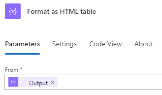

---
实验室标题：“实验室 6：计划的流” 模块：“模块 5：Power Automate 跨多个数据源的深度集成”
---

# 实践实验室 6 – 计划的流

在此实验室中，你将创建一个计划的流。

## 要学习的知识

- 如何创建 Power Automate 计划的流并处理 SharePoint 项列表。

## 概要实验室步骤

- 创建计划流
- 查询 SharePoint 列表
- 使用数据操作
- 测试流
  
## 先决条件

- 必须已完成**实验室 3：SharePoint**

## 详细步骤

## 练习 1 - 创建计划的流

### 任务 1.1 - 创建触发器

1. 导航到 Power Automate 门户 <https://make.powerautomate.com>。

1. 确保你位于“Dev One”环境中。****

1. 从左侧菜单中选择“+ 创建”选项卡。****

1. 选择“计划云端流”****。

1. 输入 `Daily New Tasks` 作为流名称。

1. 选择“天”。****

    

1. 选择**创建**。

### 任务 1.2 - 配置触发器

1. 选择“定期”步骤。****

1. 选择“手动触发流”并输入 `Daily`。****

### 任务 1.3 - 查询新任务

1. 选择触发器步骤下的 + 图标，然后选择“添加操作”。********

1. 在搜索中输入“`list items`”。

1. 选择 SharePoint 下的“获取项”。********

1. 选择“获取项”并输入 `New tasks`。****

1. 选择“Power Automate SharePoint 网站”。****

1. 选择“任务”列表。****

1. 选择“全部显示”。****

1. 选择“筛选查询”**** 字段并输入 `ApprovalStatus eq 'New'`

    

### 任务 1.4 - 选择列

1. 选择“新建任务”步骤下的 + 图标，然后选择“添加操作”。********

1. 在搜索中输入“`Select`”。

1. 对于“运行时”，选择“内置”。********

1. 在“数据操作”下选择“选择”。********

1. 选择“发件人”字段，然后选择“动态内容”图标。****

1. 从“新建任务”中选择“正文/值”。********

1. 选择“输入键”字段并输入 `Task`。****

1. 选择“输入值”字段，然后选择“动态内容”图标。****

1. 从“新建任务”中选择“标题”。********

1. 选择“输入键”字段并输入 `Description`。****

1. 选择“输入值”字段，然后选择“动态内容”图标。****

1. 从“新建任务”中选择“说明”。********

1. 选择“输入键”字段并输入 `Due`。****

1. 选择“输入值”字段，然后选择“动态内容”图标。****

1. 从“新建任务”中选择“截止时间”。********

    

### 任务 1.5 - 创建表

1. 选择“选择”步骤下的 + 图标，然后选择“添加操作”。********

1. 在搜索中输入“`create html`”。

1. 在“数据操作”下选择“创建 HTML 表”。********

1. 选择“创建 HTML 表”并输入 `Format as HTML table`。****

1. 选择“发件人”字段，然后选择“动态内容”图标。****

1. 从“选择”中选择“输出”。********

    

### 任务 1.6 - 发送电子邮件

1. 选择“创建 HTML 表”步骤下的 + 图标，然后选择“添加操作”。********

1. 在搜索中输入“`email`”。

1. 在“Office 365 Outlook”下选择“发送电子邮件(V2)”。********

1. 选择“发送电子邮件(V2)”并输入 `Notify by email`。****

1. 选择“收件人”字段，然后选择“输入自定义值”。********

1. 对于“收件人”，输入你的租户用户 ID。****

1. 选择“主题”字段并输入 `Daily Tasks`。****

1. 选择“正文”字段，然后选择“动态内容”图标。****

1. 选择“HTML 格式表”作为“输出”。********

1. 选择“保存”。

## 练习 2 - 测试计划的流

### 任务 2.1 - 手动运行计划的流

1. 选择“测试”****

1. 选择“手动”****。

1. 选择“测试”。

1. 选择**运行流**。

1. 选择**完成**。

1. 在 Power Automate 门户中，选择浏览器窗口左上角的“应用启动器”，然后选择“Outlook”。********

    
