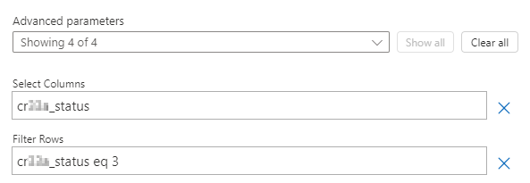

---
实验室标题：“实验 7：触发器筛选器”模块：“模块 5：Power Automate 跨多个数据源的深度集成”
---

# 练习实验室 7 - 触发器筛选器

在此实验室中，你将筛选更新触发器。

## 要学习的知识

- 如何筛选触发器

## 概要实验室步骤

- 创建自动流
- 添加列筛选器
- 添加查询筛选器

## 先决条件

- 必须已完成“**实验室 2：数据模型**

## 详细步骤

## 练习 1 - 架构名称

### 任务 1.1 - 列架构名称

1. 导航到 Power Apps Maker 门户 <https://make.powerapps.com>。

1. 确保你位于 **Dev One** 环境中。

1. 在左侧导航窗格中，选择**表**。

1. 选择“**机会**”

1. 在**架构**下面，选择**列**。

1. 选择“**状态**”列。

    

1. 展开“高级选项”。

    

1. 复制**逻辑名称**，以便在流中使用。

   > **注意：** 状态列的前缀可能有所不同。

## 练习 2 - 创建自动化流

### 任务 2.1 - 创建触发器

1. 导航到 Power Automate 门户 <https://make.powerautomate.com>。

1. 确保你位于 **Dev One** 环境中。

1. 从左侧菜单中选择“**+ 创建**”选项卡。

1. 选择“**自动化云端流**”。

1. 输入 `Opportunity Closed` 作为流名称。

1. 在“搜索所有筛选器”中输入 `Dataverse`。

1. 选择“**添加、修改或删除行时**”。

1. 选择**创建**。

### 任务 2.2 - 配置触发器

1. 选择“**添加、修改或删除行时**”这一步骤。

1. 选择“添加、修改或删除行时”步骤名称，然后输入 `Opportunity changed`****。

1. 为“**更改类型**”选择“**已修改**”。

1. 为“**表名称**”选择“**机会**”。

1. 为“范围”选择“组织”

    

### 任务 2.3 - 发送电子邮件

1. 选择触发器步骤下的 **+** 图标，然后选择“**添加操作**”。

1. 在搜索中输入“`email`”。

1. 在“**Office 365 Outlook**”下选择“**发送电子邮件(V2)**”。

1. 选择“发送电子邮件(V2)”步骤名称并输入 `Notify by email`****。

1. 选择“**收件人**”字段，然后选择“**输入自定义值**”。

1. 对于“**收件人**”，输入你的租户用户 ID。

1. 选择“**主题**”字段并输入 `Opportunity closed`。

1. 选择“**正文**”字段，然后选择“动态内容”图标。

1. 从“**更改的机会**”中选择“**机会主题**”。

1. 依次选择“正文”字段、“动态内容”图标和“查看更多”********。

1. 从“**更改的机会**”中选择“**状态**”。

### 任务 2.4 - 列筛选器

1. 选择“更改的机会”触发器步骤****。

1. 选择“**全部显示**”。

1. 选择“**选择列**”字段并输入 `cr977_status`

   > **注意：** 状态列的前缀将有所不同。

### 任务 2.5 - 行筛选器

1. 选择“**更改的机会**”步骤。

1. 选择“**全部显示**”。

1. 选择“**筛选器行**”字段并输入 `cr977_status eq 3`

    

    > **注意：** 状态列的前缀将有所不同。

1. 选择“保存”。

1. 从命令栏左上角选择 **<-** 后退按钮。
